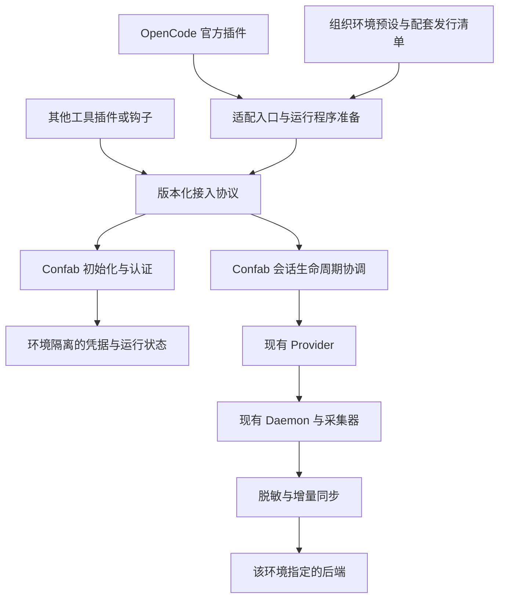
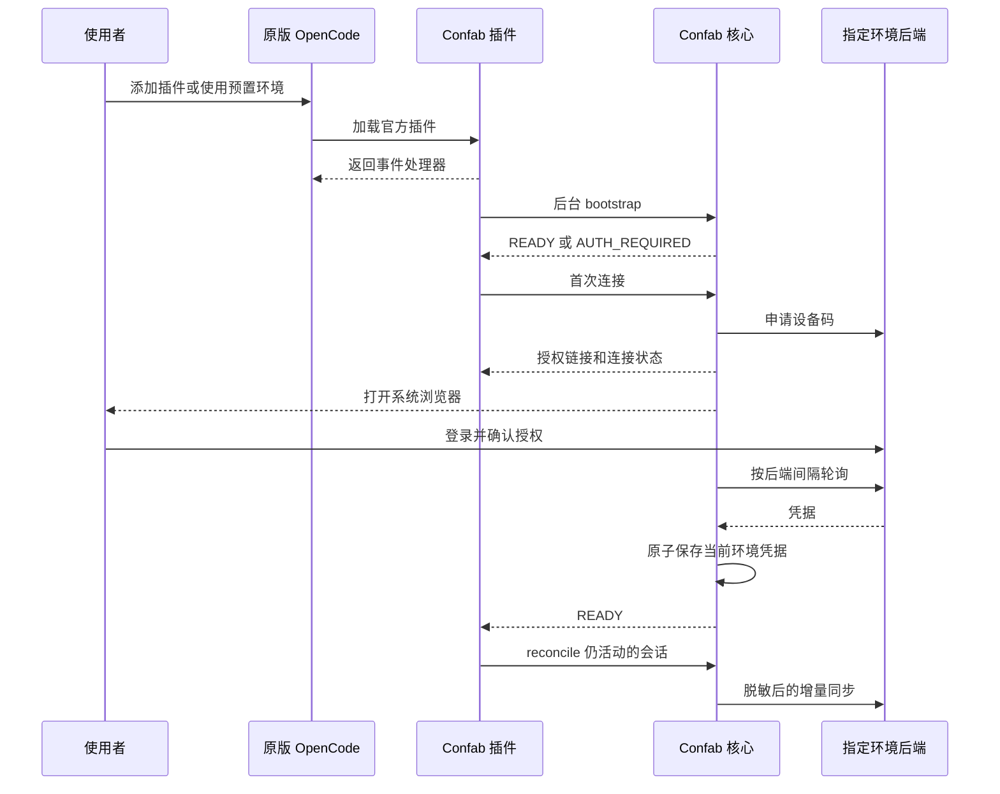

# Confab 通用接入与低配置分发：开发设计方案

版本：0.2（方案已确认，实施准备）｜确认日期：2026-09-16｜范围：首个 OpenCode 接入，保留其他工具扩展能力

需求真源：[通用接入 PRD](../prd/universal-onboarding.md)。本文定义技术方案；执行现状见[交接记录](../handoff/universal-onboarding/progress.md)。

**阅读说明：用户于 2026-09-16 明确确认本方案，并要求交接到新窗口编码。按本文推荐基线进入实施；新增命令、目录、包名、状态和接口是开发目标，尚未实现。未提供的实际后端地址、发行源、内网条件和精确版本不能从方案确认中推导，见第 13 节；这些信息不阻塞 S0。**

## 1. 评审摘要

推荐采用“独立工具适配器 + Confab 通用核心 + 环境预设”的架构。OpenCode 使用官方插件机制，不修改其源码、程序文件或安装包。后续接入 Codex、Claude Code、Cursor 时，复用相同认证、状态与同步核心，为各工具增加适配入口。

首版建议将 Windows x64 的 Confab 程序随插件发行包携带。用户添加组织提供的插件后，插件自动完成程序定位、配置初始化和接入；新用户只进行首次网页授权。已有同环境有效凭据直接复用。

| 事项 | 建议 | 状态 |
| --- | --- | --- |
| OpenCode 接入方式 | 官方插件，不改宿主源码 | 用户已确认 |
| 使用者操作 | 添加插件一次；首次网页授权。统一下发可省去添加插件 | 目标已确认 |
| 通用性 | 共用核心和接入协议，各工具提供自己的适配器 | 目标已确认 |
| 验证顺序 | 先外网，后内网；两者使用同一套代码 | 用户已确认 |
| 首版平台 | Windows x64；明确 Windows/OpenCode/Bun 版本后冻结矩阵 | 按确认方案实施，精确版本由 S0 核定 |
| 程序获取 | 首版随插件包携带，不在插件启动时再下载 EXE | 按确认方案实施 |
| 内网发行 | 有私服则镜像发行包；完全离线则使用自包含目录包 | 条件待确认 |
| 升级策略 | 插件与核心配套、固定版本、可回退；禁止托管核心自行更新到公网版本 | 按确认方案实施 |

这里的“通用插件”是一个产品家族，共享核心和协议；不是要求一个插件文件能够被所有工具直接加载。

## 2. 目标、非目标与现有基础

### 2.1 用户目标

| 角色 | 需要做的事 | 不再要求 |
| --- | --- | --- |
| 普通使用者 | 添加组织插件；在浏览器完成首次授权 | 安装 CLI、运行 setup、填写后端地址、配置 PATH、选择 EXE |
| 统一下发管理员 | 选定环境预设、版本及分发源，预置插件入口 | 为每位使用者手工执行初始化 |
| 后续工具适配开发者 | 映射宿主事件、实现连接状态提示 | 重写认证、脱敏、上传和断点恢复 |

“首次授权”是一个用户流程，可能包含网页登录及授权确认，不能将其宣传为零点击。明确需要保留每个使用者自己的身份和凭据。

### 2.2 首版非目标

- 不修改或 fork OpenCode，不依赖私有接口注入。
- 不用 TypeScript 重写已有 Go 同步引擎，不注册 Windows 服务或计划任务。
- 不在第一版同时交付所有工具的完整接入体验。
- 不把 API Key 打进发行包，也不通过默认公共后端规避配置。
- 不自动扫描并上传所有历史会话；只处理用户当前及后续实际激活的会话，恢复会话的历史补齐范围应在授权说明中展示。
- 不承诺修复 Codex 桌面应用自行启动 `gh.exe` 的窗口行为；本项目负责自己及其子进程。

### 2.3 已核实的基础和缺口

| 能力 | 当前证据 | 设计处理 |
| --- | --- | --- |
| 多工具 provider 边界 | `pkg/provider/provider.go` 已注册四类 provider | 保留并复用，不再造并行采集框架 |
| OpenCode 采集 | `pkg/provider/opencode_db.go`、`opencode_collector.go` | 继续通过 SQLite 物化和现有同步引擎上传 |
| 设备码认证 | `cmd/login.go`；真实授权曾完成，后续复查出现接口超时 | 下沉可复用认证逻辑，增加机器接口与准确状态分类 |
| 插件源码与安装 | `pkg/provider/plugins/confab-sync.ts`、`pkg/provider/opencode.go` | 改造为正式发行插件；托管接入不再调用交互式 setup 安装自身 |
| npm 发行 | 当前插件 `package.json` 为 `private: true` 的测试工程 | 新建正式发行工程，不把测试工程直接当产品发布 |
| 配置隔离 | `CONFAB_CONFIG_PATH` 只改变配置文件；`pkg/confabpath` 仍固定用户目录 | 增加完整运行上下文，隔离凭据、状态、日志和物化文件 |
| 凭据绑定 | `pkg/config/binding.go` 已有 provider/config-dir 绑定；自定义目录支持范围有限 | 与环境上下文分层，不将现有绑定误当完整环境隔离 |
| Windows 运行 | 停止标记、Git 无窗口启动已有本地修复和测试 | 纳入正式发行与真实宿主验证 |
| 正式制品 | `.goreleaser.yaml` 当前只有 Linux/macOS | 补齐目标平台制品，建立与插件配套的发行清单 |
| 自动更新 | `cmd/update.go` 默认可能查询公网并安装另一版本 | 托管模式必须关闭该路径，避免绕过内网与配套版本管理 |

此前 Windows 与便携运行改造已作为独立代码基线纳入版本管理。开发前仍需确认实际 HEAD 和工作区；已有 ZIP 和测试结果不代表本方案已经完成。

## 3. 产品流程

### 3.1 干净环境首次接入

1. 使用者在原版 OpenCode 中添加指定插件，或管理员预置插件配置。
2. 插件读取发行包内的环境预设，验证平台、核心协议版本和程序摘要。
3. 自动将核心准备到用户级版本目录，以绝对路径调用；不依赖 PATH。
4. 检查当前环境凭据。有效则就绪；不存在则进入连接流程。
5. 首次交互式使用时打开系统浏览器授权页，并在宿主中提示连接状态。自动打开失败时提供可复制链接与验证码。
6. 授权成功后由核心保存凭据、初始化脱敏配置，处理当前仍活动的会话。
7. 后续启动直接复用配置；不会每次打开浏览器。

宿主插件初始化必须及时返回。网络校验、授权轮询和核心准备在后台进行，不能等待用户授权后才让 OpenCode 可用。无 UI 的运行模式不能靠无限重开浏览器重试。

### 3.2 日常、暂停与重新连接

- 只在新建、恢复或相关活动事件发生时协调同步，正常事件去重后不重复创建进程。
- “暂停同步”默认作用于当前集成（环境、provider、数据源），将其暂停状态写入该环境的控制文件并停止对应守护进程；不顺带暂停其他工具。新会话收到事件仍返回暂停状态，不能再次自动拉起。
- 暂停保留凭据；“重新连接”处理失效凭据；“卸载”移除适配入口。三者含义不同。
- 当前主机仅结束进程而保留启动钩子的方式会被新会话重新拉起，不能作为最终暂停能力。

### 3.3 旧用户迁移

- 读取旧配置前先匹配完整后端身份；校验成功才复制凭据到新环境，不移动或删除原配置。
- 发现旧本地插件、旧钩子或活动守护进程时，进入迁移提示，避免新旧两套同时运行。
- 仅处理能确认属于 Confab 管理的文件/区块：先备份并停用旧自动启动入口，再受控停止旧进程，最后启用新入口并验证，避免停止后立即被旧钩子拉起。用户自定义内容不能直接覆盖。
- 迁移是旧用户的一次性操作，不计入干净环境的最简接入流程，但必须有可回退方案。

## 4. 总体架构与模块边界



| 模块 | 职责 | 不承担的职责 |
| --- | --- | --- |
| 工具适配器 | 接收宿主事件、提供连接提示、将请求交给核心 | 不读取并重写全部会话、不保存 API Key、不实现上传协议 |
| 程序准备模块 | 定位随包程序、摘要校验、并发安装、版本目录和绝对路径 | 不执行网页登录，不维护另一套同步状态 |
| 接入协议入口 | 参数校验、结构化响应、错误分类和协议兼容 | 不依赖 OpenCode 的 SDK 类型 |
| 初始化与认证 | 环境识别、凭据复用、设备码流程、暂停状态 | 不修改宿主源码或其他工具配置 |
| 既有核心 | provider、进程、采集、脱敏、增量上传 | 不依赖 npm 包名和宿主 UI |

首次程序准备存在“还没有核心 EXE”的阶段，因此 OpenCode 插件中必须有少量引导代码。首版将其保持为适配器内部模块；只有第二个实际调用方出现且确有复用时，再提取独立 JS 库。非 JS 工具直接使用相同 CLI/JSON 协议，不强制依赖 Node.js。

保留现有按根会话运行 daemon 的模型，不为“通用”额外增加一个常驻总服务或本地 HTTP 服务。

## 5. 分发方案与外网、内网切换

### 5.1 推荐：运行程序随发行包携带

以下为结构示例，包名、版本、URL 均不表示已经发布：

```text
confab-opencode-<deployment>/
  package.json
  dist/index.js
  deployment/profile.json
  runtime/windows-amd64/confab.exe
  runtime/manifest.json
  LICENSE
  README.md
```

普通使用者只获得插件入口；EXE、组织地址及初始化被封装在包内。添加 npm 插件仍需要宿主能够获取整个包；“不额外下载 EXE”不等于“npm 安装天然离线”。

| 方案 | 优点 | 成本/限制 | 首版建议 |
| --- | --- | --- | --- |
| 程序随插件包携带 | 无额外启动下载，固定版本，内外网制品一致性容易验证 | 包更大，需要按平台发行 | 推荐 |
| 薄插件首次下载核心 | 插件体积小，核心可独立分发 | 增加网络、代理、证书、源配置及半安装故障 | 后续按需支持 |
| 纯 TypeScript 插件 | 不运行 Go 程序 | 重写采集、脱敏、同步和恢复，损失已有多工具核心 | 不采用 |
| 仅提供 MCP 服务 | 可以暴露查询等能力 | 不能假定所有宿主会把完整会话生命周期交给 MCP | 不作为自动采集通路 |

多平台扩展采用相同清单与协议，再评估平台子包；首版不提前建设完整插件市场或复杂下载服务。

### 5.2 环境预设

预设由管理员/发行流程提供，使用者不填写。建议包含：

| 字段 | 用途 |
| --- | --- |
| `schema_version` | 配置格式版本 |
| `profile_id`、`display_name` | 稳定环境标识和对使用者显示的名称 |
| `backend_url` | 认证和上传的明确目标 |
| `allowed_providers` | 该发行包允许接入的工具 |
| `core_version`、`protocol_version` | 固定核心与接入协议版本 |
| `artifacts[platform].path/sha256` | 包内程序相对路径与校验值 |
| `update_policy` | 首版为配套包更新，不查询公网 latest |

不包含用户凭据。相对程序路径不得逃出包目录；版本与摘要不匹配时停止该集成并显示修复提示，不能回退到 PATH 中未知的旧 EXE。

程序摘要检查用于完整性；制品来源可信度仍依赖受控发行源、包完整性元数据和发布权限，不能把一个可同时被替换的 SHA256 文件当作签名。

### 5.3 外网与内网模式

| 项目 | 外网验证 | 内网私服 | 完全离线 |
| --- | --- | --- | --- |
| 插件来源 | 评审指定的外网测试源 | 内网 npm/制品仓库 | 管理员下发自包含目录包 |
| 核心程序 | 随包 | 随包 | 随包 |
| 后端 | 外网测试后端 | 内网后端 | 可达的内网后端；不能上公网不代表没有内部网络 |
| 环境预设 | 外网测试预设 | 内网预设 | 包内内网预设 |
| 公网依赖 | 安装时按测试源允许 | 不应需要 | 不允许 |

离线包将编译好的插件 JS 放入官方插件目录，程序和预设放入旁侧的 Confab 目录。打包时包含自身全部运行依赖，不能要求首次运行再执行 `bun install` 或拉取公网包；宿主运行时内置能力不重复打包。

管理员预置配置属于部署工作，不能修改或替换 OpenCode 程序文件。不同部署预设导致内容变化时，必须使用不同包身份/版本或独立受控配置文件；不得在内外网仓库发布“同名同版本但内容不同”的包。

外网到内网迁移只更换发行源和环境预设，不改业务代码；外网凭据不复制为内网凭据，也不迁移外网会话上传断点到内网。

## 6. 运行目录、凭据与并发隔离

建议目录：

```text
~/.confab/
  runtimes/<version>/<platform>/<sha256>/confab.exe
  environments/<profile-id>-<backend-hash>/
    config.json
    control.json
    logs/
    sync/<provider>/
    opencode/
    locks/
  session-owners/
```

- 环境身份由受校验的 `profile_id` 和规范化后端地址共同确定；规范化基于解析后的 scheme、host、port、base path，保留路径大小写语义，禁止 URL 内嵌用户名密码。后端地址改变不能静默继承旧凭据。
- 新增内部 `CONFAB_HOME` 运行上下文（拟议），由启动方仅传给 Confab 子进程。它统一覆盖 Confab 自有配置、日志、状态和物化文件路径，不修改系统环境变量或宿主的 HOME/USERPROFILE。
- 托管子进程不继承会把配置导向别处的旧 `CONFAB_CONFIG_PATH`。同时保留非托管 CLI 的原有默认行为，并测试两种入口不会混用。
- 现有 provider/config-dir binding 在选定环境内继续生效；不通过本次改造自动宣称所有 provider 都支持自定义配置目录。
- 同一环境的凭据可由多个工具复用；API Key 只由 Go 核心读取和保存，不返回给插件或模型上下文。
- 程序准备按版本/平台/摘要加锁；先写临时文件、验证、再发布不可变目录，不覆盖运行中的 EXE。
- 认证按环境加 OS 级进程锁；多窗口只能产生一个有效授权流程。锁随进程退出释放，不能仅凭 PID 文件判定锁有效。
- 同步所有权按 provider、规范化数据源身份和根会话 ID 判重。OpenCode 数据源身份应包含 SQLite 路径，不能假定配置目录等于数据目录。
- 每个适配器实例有独立 `host_instance_id`，协调和释放请求都携带它。PID 用于存活检查，不作为唯一所有权证明；同一宿主进程内的多个插件实例不能互相停止会话。
- `control.json` 按 provider/数据源分别保存暂停状态，凭据仍按环境共享。首版不把单工具“暂停”扩展成默认的全环境停机。
- 全局所有权检查阻止同一会话被两个环境或新旧入口无意重复采集。发现旧实例时进入迁移/冲突状态，不能绕过它再启动一套。

同一根会话被多个宿主进程同时打开时，首版建议保留单拥有者：第二方收到 `SESSION_BUSY`，不发送拥有者的停止请求，可在后续活动时重试接管。完整多拥有者租约不纳入首版，必须把这一限制展示和测试清楚。

## 7. 通用接入协议（拟议）

提供 `confab integration <action> --json`，使用 UTF-8 stdin 接收结构化请求，stdout 输出结构化响应，stderr 只输出诊断。命令与类型最终在评审后冻结，不能作为当前 CLI 已有能力使用。

| action | 行为 |
| --- | --- |
| `bootstrap` | 校验环境及核心协议、准备本地状态、返回认证状态；不安装宿主插件 |
| `status` | 返回当前环境、认证、暂停及同步状态，不返回密钥 |
| `connect` | 复用认证逻辑，输出 JSONL 进度；支持取消和授权期限 |
| `reconcile` | 处理已激活会话，归一化根会话、检查暂停/授权/所有权，再调用现有生命周期逻辑 |
| `release` | 释放本调用方拥有的会话，进行最终同步和停止 |
| `pause` / `resume` | 持久暂停/恢复当前集成的自动协调，避免下个事件立即重启 |

请求示意：

```json
{
  "protocol_version": 1,
  "request_id": "example-request",
  "provider": "opencode",
  "host_instance_id": "example-plugin-instance",
  "session": {
    "id": "example-session",
    "cwd": "C:/work/example",
    "host_pid": 1234
  }
}
```

通用 envelope 只传生命周期元数据，不传整段会话正文。不同 provider 必需的 transcript 路径、父会话等字段使用有类型的扩展结构；不以无限制 `any` 代替协议。归一化协议不等于宿主原始 wire format，两者分别测试。

响应示意：

```json
{
  "protocol_version": 1,
  "request_id": "example-request",
  "status": "AUTH_REQUIRED",
  "error": null,
  "next_action": "connect"
}
```

约束：

- 请求及单条响应有明确大小上限，建议控制消息为 64 KiB；输出中禁止出现 API Key、device_code 等凭据。
- 使用 argv 数组和 stdin，不拼接 `echo JSON | command`。Windows 启动设置隐藏窗口；Go 内部 Git 命令和后台进程同样受控。
- 同步请求有超时，授权请求有独立期限和取消机制；所有子进程退出状态必须处理。
- 退出码 0 只表示请求被处理，调用者仍须读取 `status`；非零错误同时提供机器可读错误码。
- `reconcile` 成功响应须区分启动、已运行、未授权、暂停和冲突，不能把“未启动”加入已运行集合。
- 正常事件白名单与根会话去重沿用现有思路；不同调用方必须通过所有权校验才能停止进程。
- 不把内部 `--bg-daemon` 参数直接公开成跨工具契约；由接入入口复用现有启动实现。

## 8. 认证、状态提示与非阻塞流程



| 状态/错误 | 使用者看到的内容 | 程序行为 |
| --- | --- | --- |
| `PREPARING` | 正在准备组件 | 合并并发准备请求，不阻塞宿主 |
| `AUTH_REQUIRED` / `AUTH_PENDING` | 需要授权 / 等待授权 | 同环境单一流程；不在每个会话事件上重复打开浏览器 |
| `READY` | 已连接 | 处理活动会话 |
| `BACKEND_UNREACHABLE` | 后端暂不可达 | 保留凭据并退避重试，不提示密钥失效 |
| `CREDENTIAL_REJECTED` | 授权已失效，需要重新连接 | 依据明确的服务端认证拒绝判断 |
| `AUTH_EXPIRED` / `AUTH_CANCELLED` | 本次授权未完成 | 结束轮询，由用户显式重试 |
| `PAUSED` | 同步已暂停 | 新会话不自动重启守护进程 |
| `RUNTIME_INVALID` / `UNSUPPORTED_PLATFORM` | 组件损坏或平台不受支持 | 停止该集成，宿主保持可用 |
| `LEGACY_INSTALL_DETECTED` / `SESSION_BUSY` | 存在旧实例或当前会话已被占用 | 提供迁移或稍后重试，不重复上传 |

当前 OpenCode 官方接口支持事件和 dispose；具体状态通知入口、CLI/桌面展示及浏览器唤起需在兼容性验证中确认。不能将面向模型供应商的 auth 钩子直接冒用为 Confab 会话归档登录。

事件字段必须以所选发行版本的实际类型和样本验证，不能仅靠当前仓库自建的 SDK 类型桩。首版采集前提是插件与 OpenCode 数据库位于同一受支持运行环境；远程宿主/数据源不在本机时不得静默读取另一份本地数据库。

首次无授权时不启动采集器，仅在内存保留有界的活动会话引用；授权成功后重新核实宿主仍存活、会话仍活动，再协调采集。已有授权的用户发生短暂网络故障时，沿用本地物化和增量重试能力；不因超时清空密钥。

Windows 使用系统浏览器启动能力打开授权地址，不能仅依赖当前只覆盖 macOS/Linux 的 `openBrowser`。登录后回到设备授权页属于后端前端行为：必须实测 return-to/验证码上下文；若不满足，需要在后端仓库调整，而不是修改 OpenCode。

## 9. 生命周期、兼容性和回退

- OpenCode 的新建/恢复事件触发协调；dispose 作为正常释放入口，父进程 liveness 作为异常退出兜底。不能依赖窗口关闭事件总能送达。
- Codex 后续适配继续遵守“每回合 Stop 不等于会话结束”，不能把所有工具的 Stop 统一映射成 daemon shutdown。
- 暂停先持久化控制状态，再停止对应环境下的进程；运行中的 daemon 也应观察暂停控制，以覆盖启动与暂停的竞争。
- 插件升级时验证新旧协议兼容，准备新不可变程序目录；已有会话可用原版本结束，新会话使用新版本。不原地覆盖占用中的 EXE。
- 首版建议只允许组织发布的固定版本更新，不启用核心自己的公网更新。
- 回退选择旧插件与旧核心配套版本，保留凭据和可读状态格式；涉及不可逆状态迁移时必须另行设计迁移/备份，不能只回退二进制。
- 本方案不新建第二套无限内存队列。沿用现有磁盘物化与分块上传；磁盘写入失败应展示明确错误。企业保留期限和容量政策若需调整，单独确认范围。

## 10. 代码改动范围建议

| 位置 | 拟议改动 | 边界 |
| --- | --- | --- |
| `packages/opencode-plugin/`（新增） | 正式插件工程、程序准备、预设读取、宿主提示、协议调用、构建与发行测试 | 不 fork OpenCode；生产 JS 打包自身运行依赖 |
| `cmd/integration*.go`（新增） | 版本化机器入口，复用已有生命周期与认证能力 | 不解析 OpenCode SDK 对象 |
| `pkg/onboarding/`（新增） | 环境检查、授权状态机、认证锁与暂停协调 | 不依赖 `cmd`，避免反向依赖 |
| `cmd/login.go` | 将认证业务提取到可复用模块，CLI 保持薄包装 | 保留现有手动 CLI 的受支持行为 |
| `pkg/config/`、`pkg/confabpath/` | 环境根目录、受控旧凭据导入、配置原子写入 | 不用修改 HOME/USERPROFILE 解决产品隔离 |
| `cmd/spawn.go`、`pkg/daemon/` | 运行上下文继承、进程所有权、暂停与停止 | 复用现有采集和最终同步；不能跨环境停止 |
| `pkg/provider/` | 接入协议到已有 provider 的映射；绑定适用范围验证 | 不改各工具源码，不重写扫描逻辑 |
| `pkg/provider/plugins/` | 明确旧模板与新发行插件的归属，迁移共享生命周期逻辑 | 不长期维护两份有差异的同一插件实现 |
| `cmd/update.go` | 托管模式禁止自行下载/切换核心 | 非托管 CLI 是否改造另定范围 |
| `.goreleaser.yaml`、CI、打包脚本 | 目标平台制品、配套版本清单、离线验证 | 不在评审前发布包或推送标签 |
| `test/portable/` 及新增接入测试 | 使用真正发行包做首次接入、协议、升级和窗口测试 | 保留可复用虚构会话与模拟后端 |

新增模块是职责边界建议，具体文件数量在实现时以最小可验证改动为准。现有后端同步 API 原则上复用；设备授权前端和契约需读取实际后端实现后确认，不能保证后端零改动。

## 11. 分阶段开发与交付

以下切片随方案确认进入实施路线，已按 `to-issues` 落到项目内 `.trellis/tasks`。任务目录中的 `prd.md` / `task.json` 是执行真源；当前均为 pending，新窗口从 S0 开始。

| 切片 | 可演示结果 | 主要范围 | 依赖/完成条件 |
| --- | --- | --- | --- |
| [S0 兼容性验证](../../.trellis/tasks/universal-onboarding-s0-compatibility/prd.md) | 原版 OpenCode 加载独立插件，能显示连接状态、启动随包 EXE、收到退出信号 | 最小插件、真实官方 SDK/宿主、Windows 启动观察 | 固定宿主与运行时版本；不依赖自建类型桩证明兼容 |
| [S1 首次接入闭环](../../.trellis/tasks/universal-onboarding-s1-first-connection/prd.md) | 干净环境添加插件→预置后端→网页授权→一条虚构会话同步 | 发行包、环境上下文、认证机器接口、OpenCode 适配 | S0；无 setup/PATH/手填 URL，无明文密钥输出 |
| [S2 可持续使用](../../.trellis/tasks/universal-onboarding-s2-reliable-lifecycle/prd.md) | 重启复用凭据、恢复会话、网络恢复、暂停后不自动重启 | 控制状态、并发与错误路径、旧安装检测 | S1；失败场景不会拖垮宿主或重复采集 |
| [S3 配套升级与通用性证明](../../.trellis/tasks/universal-onboarding-s3-managed-upgrades/prd.md) | 旧版迁移、版本升级/回退；非 OpenCode 调用方可使用同一协议 | 发行清单、版本目录、协议合同测试、已有另一 provider 的测试适配 | S2；不把第二工具完整产品交付默认塞进首版 |
| [S4 外网发布验收](../../.trellis/tasks/universal-onboarding-s4-external-acceptance/prd.md) | 从外网测试源安装真实发行包，完成真实后端授权和虚构会话上传 | 指定外网环境、发行权限、实际 UI/网络验收 | S3；产物摘要、版本与结果可追溯 |
| [S5 内网部署验收](../../.trellis/tasks/universal-onboarding-s5-intranet-delivery/prd.md) | 私服或离线方式完成同样用户流程，无公网依赖 | 内网预设、全部依赖、证书/代理、运维说明 | S4 + 内网模式确认；重新授权，不复用外网断点 |

S0 结束后再评估工期。当前未确定宿主版本、外网资源和内网分发条件，不给出缺乏依据的固定天数承诺。

## 12. 验收矩阵与交付清单

| 类别 | 必测场景 | 通过标准 |
| --- | --- | --- |
| 最少配置 | 无全局 CLI、无 Go、无 PATH 的干净用户环境 | 添加插件后只进行首次网页授权 |
| 宿主边界 | 标准 OpenCode 安装 | 源码/程序文件零修改，失败时仍可正常使用宿主 |
| 包完整性 | npm 包、镜像包、离线目录包，缺文件或摘要错误 | 完整包正常；异常包明确拒绝，不回退未知 EXE |
| 认证 | 首次、已授权、过期、取消、后端超时、网页登录跳转 | 状态准确、无重复浏览器/重复发 key、凭据不外泄 |
| 环境隔离 | 外网/内网同机、同名预设改变地址、已有 CLI 凭据 | 不串凭据、状态、断点或上传目标 |
| 并发 | 多窗口同时首次加载、重复事件、同会话多宿主 | 单认证流程、单安装写入、明确会话所有权 |
| 同步 | 新建、恢复、子会话、断网恢复、末尾消息 | 数据完整且不重复，沿用脱敏与能力开关 |
| 暂停与退出 | 暂停后新会话、正常退出、崩溃、强制退出 | 暂停不重启；无遗留持续上传进程 |
| Windows 体验 | 中文/空格/特殊字符路径、无控制台宿主 | 所有项目拥有的后台子进程无可见终端；授权浏览器除外 |
| 升级回退 | EXE 占用、升级失败、协议不兼容、旧插件并存 | 不覆盖运行文件、不双跑；可以恢复上一配套版本 |
| 通用契约 | 非 OpenCode 测试适配器调用核心 | 无 OpenCode SDK 依赖，复用同一认证与协调实现 |
| 内网 | 禁止公网、私有 CA/代理（如有）、源不可达 | 不偷连公网，不以关闭 TLS 校验作为解决方案 |

交付物：源代码与测试、正式插件包及配套核心、环境预设模板、制品摘要与依赖清单、管理员下发说明、用户首次授权说明、升级回退说明、外网验收报告；内网模式确定后增加对应部署包与验收报告。

已有便携包测试只能作为基础证据：约 46 秒可见窗口观察未发现控制台弹窗，真实设备码登录曾通过，但后续认证接口复测超时。尚未完成“原版 OpenCode 自动初始化插件＋外网真实上传＋内网安装”的完整验收。

## 13. 已确认决策与待落实信息

| ID | 事项 | 确认后的执行基线 | 待落实信息 |
| --- | --- | --- | --- |
| R1 | 核心分发方式 | 核心随插件发行包携带 | 不再重复询问是否采用此架构 |
| R2 | 内网分发条件 | 保留私服和自包含离线包两条部署路径 | 真实内网条件由用户/管理员在 S5 前提供，未默认为已有私服 |
| R3 | 首版平台和宿主版本 | Windows x64，其他 OS 后续扩展 | 精确 Windows/OpenCode/Bun/SDK 版本在 S0 查证和冻结 |
| R4 | 外网验证资源 | 专用测试环境、可控源、虚构会话 | 地址、仓库/scope、权限及责任人待提供；S0–S3 可先使用本地模拟后端 |
| R5 | 通用性证明范围 | 通用协议与另一 provider 的合同测试，完整第二适配器后续交付 | 在 S3 根据现有 provider 选择测试对象，不扩成全部工具交付 |
| R6 | 首次配置和迁移 | 自助用户添加一次；统一下发可预置；旧安装走受控迁移 | 实际下发责任人和内网运维流程在部署前落实 |
| R7 | 升级策略 | 配套固定版本与受控升级，禁止托管核心更新公网 latest | 发布源与升级权限随 R4/R2 落实 |

用户已经确认方案，不再将总体评审作为编码前置阻塞。未提供的真实资源和版本不能编造；只在推进到依赖它们的切片时补齐。方案确认不等于已授权向任意外部源发布、部署生产服务或修改实际用户配置。

## 14. 依据与验证边界

- [OpenCode 官方插件文档](https://opencode.ai/docs/plugins/)：提供本地目录和 npm 插件机制；本地插件与 npm 插件可能分别加载，因此需要旧入口检测。
- [OpenCode 公开插件类型](https://raw.githubusercontent.com/anomalyco/opencode/dev/packages/plugin/src/index.ts)：核对到 `event`、`dispose` 等扩展点。
- [OpenCode 公开插件加载实现](https://raw.githubusercontent.com/anomalyco/opencode/dev/packages/opencode/src/plugin/index.ts)：核对到事件分发与 dispose 清理调用。
- [当前便携包验证记录](../../.trellis/tasks/opencode-portable-windows/validation.md)和[后续复测](../../.trellis/tasks/opencode-portable-windows/package-retest-20260916.md)：区分本地、真实认证和未完成的端到端范围。

外部接口核对日期为 2026-09-16；上述源码是动态 dev 分支，不能据此宣称任意已安装版本都兼容。S0 必须记录实际发行版本及其固定源码/类型版本，再据此实现。本文没有发布任何包、修改宿主配置或执行生产部署。
